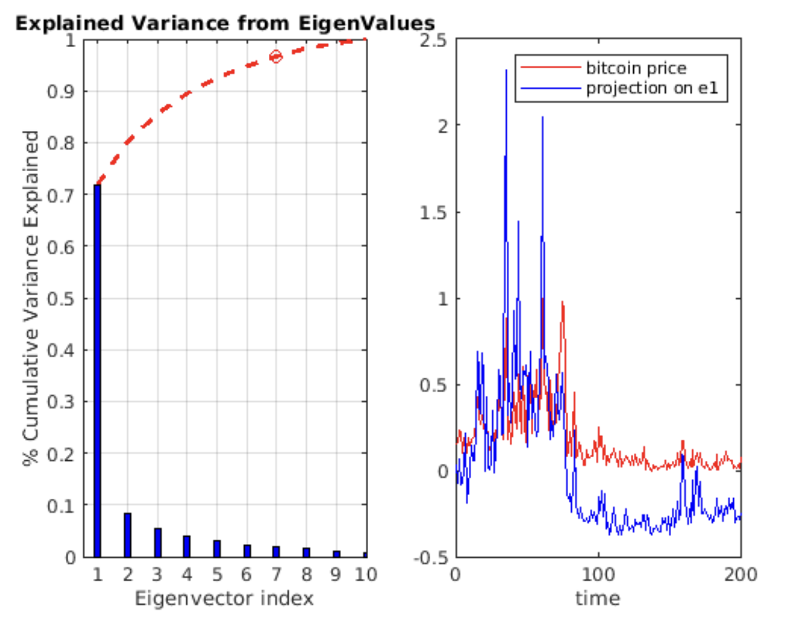
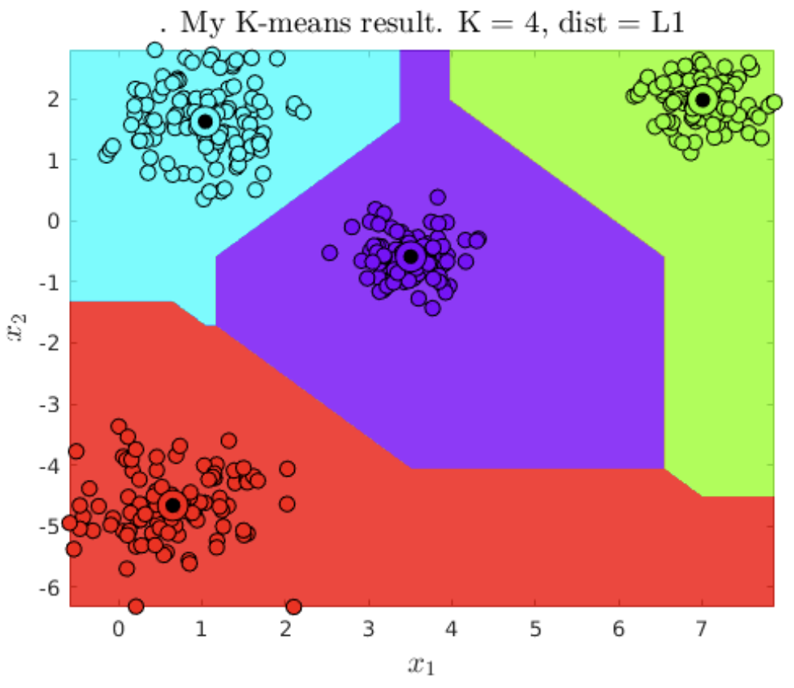
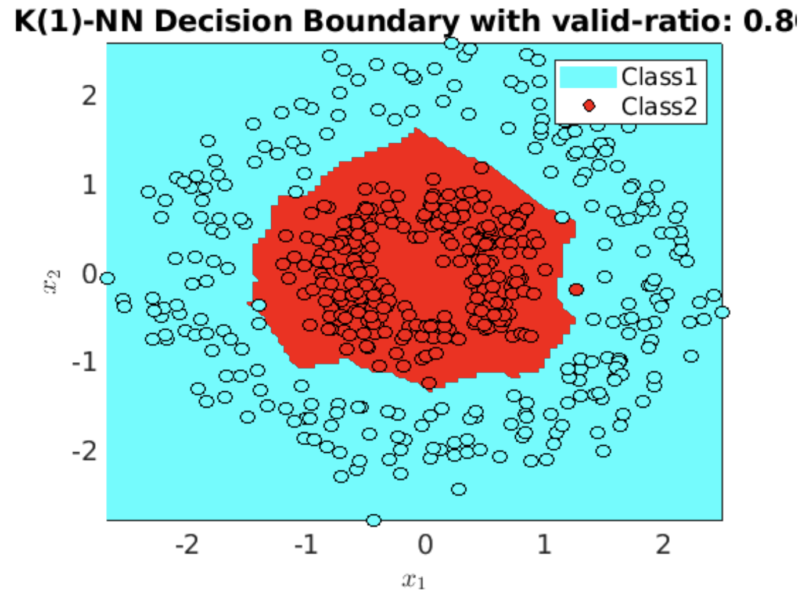
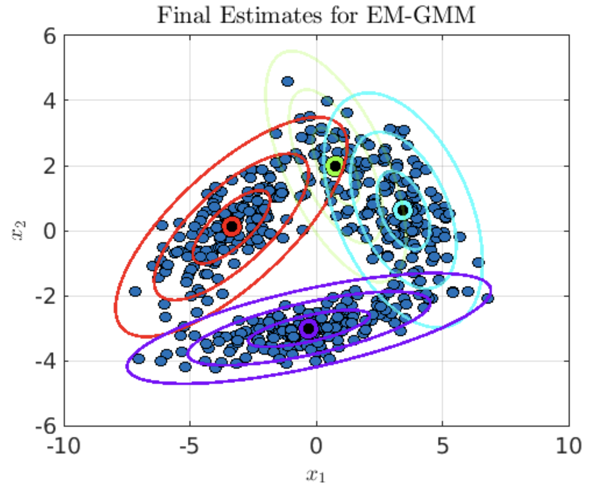
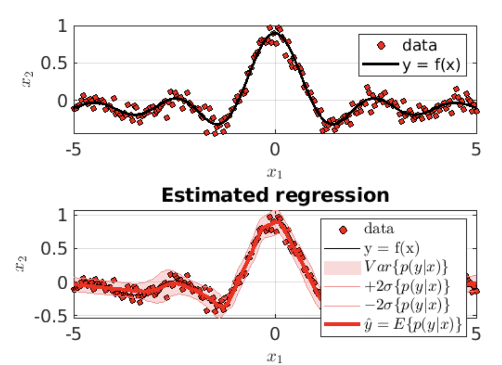
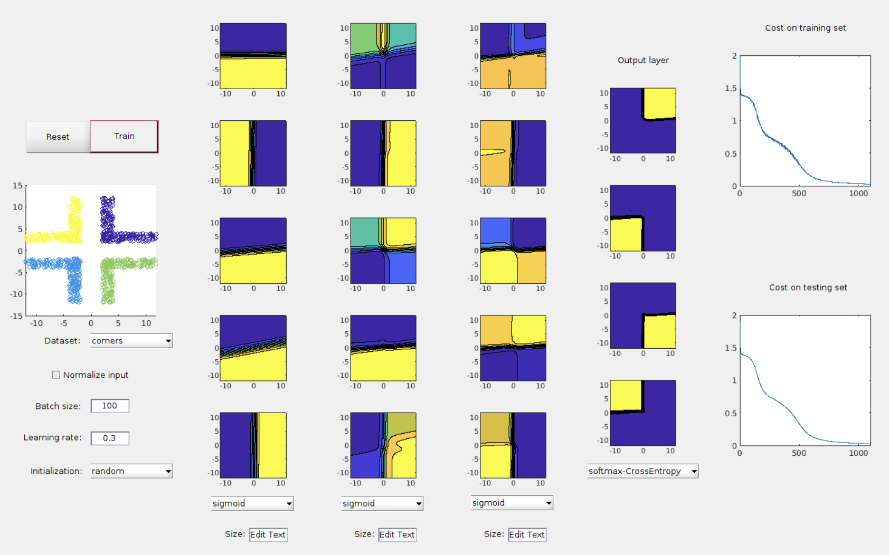

# Machine Learning Programming

This repository contains six projects as part of a machine learning course. Each project focuses on implementing a fundamental algorithm or technique in machine learning. For this course, the implementations were evaluated in MATLAB, and they explore both theoretical foundations and practical applications.

## Project Summaries

### 1. Principal Component Analysis (PCA)
- **Objective**: Implement PCA for dimensionality reduction and apply it to real-world datasets.
- **Applications**:
  - Dimensionality reduction on the Fisher-Iris dataset.
  - Image compression.
- **Key Features**:
  - Covariance matrix calculation and eigenvalue decomposition.
  - Projection to lower-dimensional spaces and data reconstruction.
  - Explained variance analysis for optimal component selection.
  

---

### 2. K-Means Clustering
- **Objective**: Implement and evaluate the K-Means clustering algorithm.
- **Applications**:
  - Clustering a high-dimensional dataset.
  - Developing a recommendation system.
- **Key Features**:
  - Centroid initialization and assignment.
  - Metrics such as Residual Sum of Squares (RSS), AIC, and BIC for model evaluation.
  - Visualization of cluster boundaries and optimization of the number of clusters.

---

### 3. K-Nearest Neighbors (KNN)
- **Objective**: Implement KNN for classification.
- **Applications**:
  - Testing on synthetic and real-world datasets.
- **Key Features**:
  - Distance computation using L1, L2, and Linf norms.
  - Majority voting mechanism for classification.
  - Evaluation of classifier performance with accuracy metrics.

---

### 4. Gaussian Mixture Models (GMM)
- **Objective**: Develop the GMM algorithm using Expectation-Maximization (EM) for parameter estimation.
- **Applications**:
  - Clustering datasets with multi-modal distributions.
- **Key Features**:
  - Implementation of full, diagonal, and isotropic covariance matrices.
  - Model evaluation using AIC and BIC metrics.
  - Visualization of Gaussian components.

---

### 5. GMM Applications
- **Objective**: Apply GMMs to classification, resampling, and regression tasks.
- **Applications**:
  - Multi-class classification using GMMs.
  - Generating synthetic data points via resampling.
  - Gaussian Mixture Regression (GMR) for non-linear regression problems.
- **Key Features**:
  - Implementation of supervised classification with GMMs.
  - Data augmentation through GMM-based resampling.
  - Regression using the conditional density of GMMs.

---

### 6. Neural Networks (NN)
- **Objective**: Build a foundational neural network for binary classification.
- **Applications**:
  - Training on synthetic datasets with visualization of decision boundaries.
- **Key Features**:
  - Implementation of activation functions (Sigmoid, ReLU, Leaky ReLU).
  - Weight initialization strategies for stable convergence.
  - Mini-batch learning and visualization of training progress.

---

## How to Use
Each project folder contains:
- MATLAB scripts for implementation (`.m` files).
- Dataset files for testing and evaluation.
- Instructions for running the code and visualizing results.

Clone the repository and explore each project to learn more about these essential machine learning algorithms.
